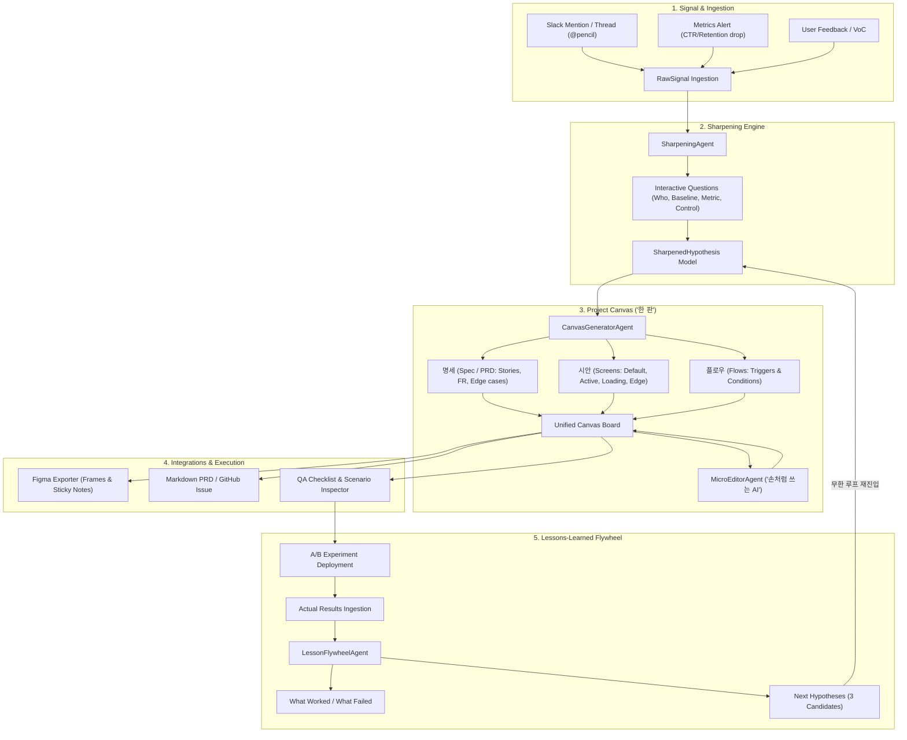

# Product Loop 아키텍처 및 시스템 설계서

## 1. 아키텍처 다이어그램

---

## 2. 핵심 엔티티 데이터 모델

### 2.1 가설 모델 (`SharpenedHypothesis`)
- `id`: 고유 식별자
- `title`: 가설 제목
- `targetUser`: 타깃 사용자 세그먼트
- `coreProblem`: 해결하려는 핵심 결핍
- `proposedSolution`: 제안 솔루션
- `comparisonBaseline`: 비교 기준 대조군
- `successMetrics`: 
  - `primary`: 1차 성공 지표
  - `targetDelta`: 목표 증감분
  - `guardrail`: 가드레일 지표
- `controlVariables`: 통제 변수 목록
- `risksAndAssumptions`: 가정 및 리스크

### 2.2 프로젝트 한 판 모델 (`ProjectCanvas`)
- `spec`:
  - `overview`: 개요
  - `userStories`: 사용자 관점의 행동 스토리
  - `functionalRequirements`: P0/P1/P2 우선순위 기능 요구사항
  - `edgeCases`: 통제할 예외 상황
  - `acceptanceCriteria`: QA 승인 기준
- `screens`:
  - `stateType`: `default` | `active` | `loading` | `error` | `empty`
  - `components`: 화면 구성 요소 목록
  - `description`: 상태별 UX 설명
- `flows`:
  - `fromScreenId`: 시작 화면
  - `toScreenId`: 대상 화면
  - `triggerAction`: 사용자 인터랙션 트리거
  - `condition`: 분기 조건

### 2.3 레슨런 모델 (`LessonLearned`)
- `verdict`: `validated` | `invalidated` | `inconclusive`
- `keyInsights`: 핵심 발견점
- `whatWorked`: 성공 요인
- `whatFailed`: 한계 및 미흡점
- `nextHypotheses`: 후속 실험으로 이어지는 다음 가설 후보군 (Title & Rationale)
