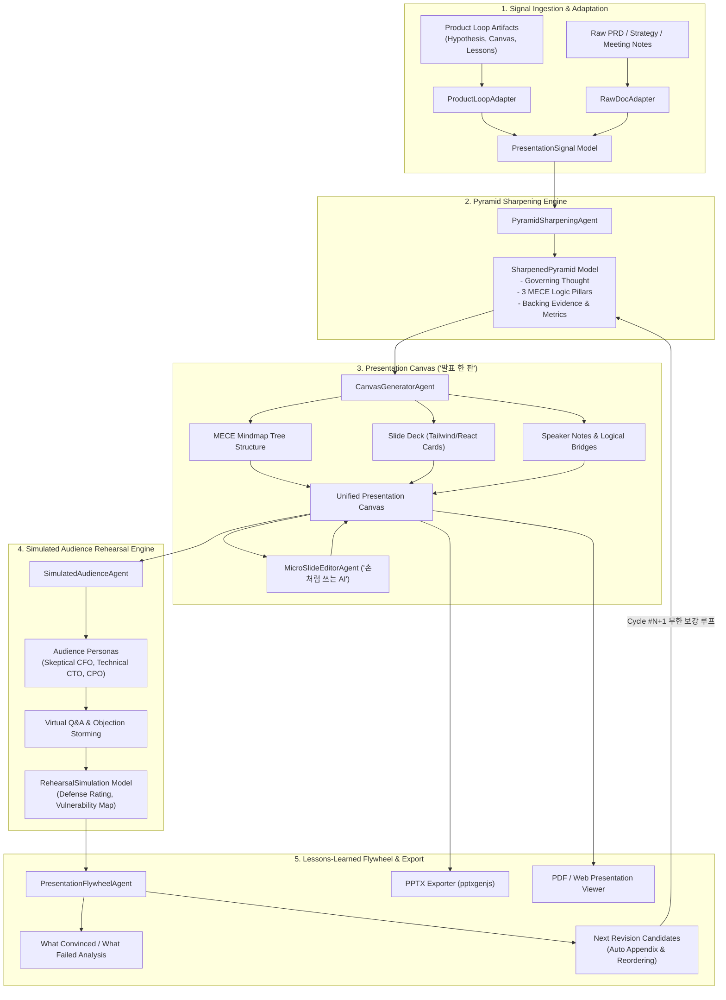
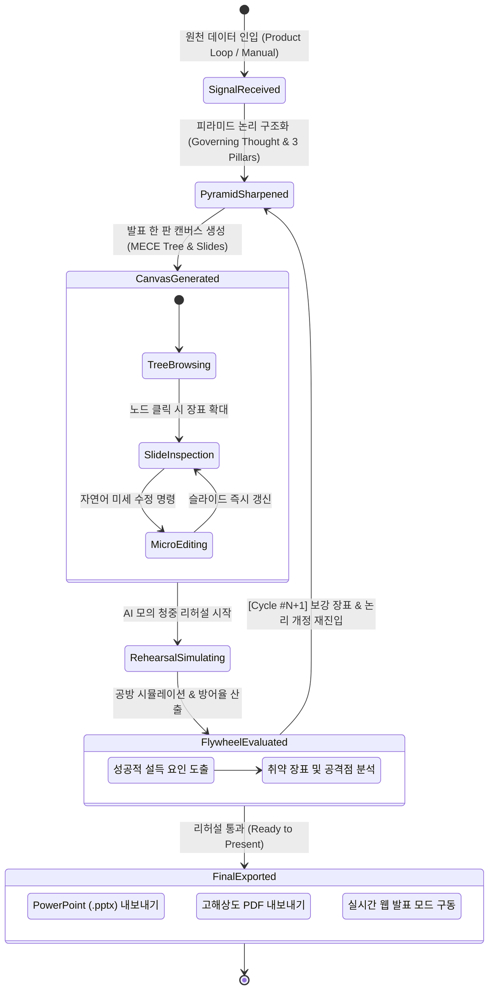

# 🏗️ Presentation Loop 시스템 아키텍처 및 상세 설계서

---

## 1. 시스템 아키텍처 다이어그램



---

## 2. 핵심 엔티티 데이터 모델 (TypeScript Definition)

```typescript
// ==========================================
// 1. Phase & Signal Types
// ==========================================
export type PresentationLoopPhase =
  | 'signal'          // 1. 원천 자료 인제스천
  | 'sharpening'      // 2. MECE 피라미드 샤프닝
  | 'canvas'          // 3. 발표 한 판 (트리 & 슬라이드 캔버스)
  | 'rehearsal'       // 4. AI 모의 청중 리허설
  | 'flywheel'        // 5. 설득 레슨런 & 보강 덱 순환
  | 'final_export';   // 6. PPTX / PDF 최종 내보내기

export interface PresentationSignal {
  id: string;
  source: 'product_loop' | 'manual_text' | 'prd_document' | 'meeting_notes';
  sourceTitle: string;
  rawContent: string;
  sourceMetadata?: {
    productLoopSessionId?: string;
    targetAudienceHint?: string;
    timeLimitMinutes?: number;
  };
  timestamp: string;
}

// ==========================================
// 2. Pyramid Sharpening Model
// ==========================================
export interface LogicPillar {
  id: string;
  title: string;          // 예: "1. 실험 리드타임 80% 단축"
  keyArgument: string;    // 핵심 논지
  subArguments: string[]; // 세부 논거 (MECE)
  evidenceData: {
    metricName: string;
    baselineValue: string;
    projectedValue: string;
    sourceRef?: string;
  }[];
}

export interface SharpenedPyramid {
  id: string;
  signalId: string;
  governingThought: string; // 단 하나의 정점 결론 (Top-level Key Message)
  targetAudience: {
    role: string;           // 예: "경영진(C-Level) 및 프로덕트 리더십"
    primaryInterest: string;// 예: "비용 절감, 전사 실험 속도, 리스크 통제"
    expectedObjection: string; // 사전 예상되는 최대 반출점
  };
  presentationConstraints: {
    targetDurationMinutes: number; // 예: 15분
    slideCountLimit: number;       // 예: 8~10장
    presentationMode: 'live_pitch' | 'asynchronous_reading' | 'board_review';
  };
  pillars: [LogicPillar, LogicPillar, LogicPillar]; // 엄격한 3대 지지 축
  riskMitigationNotes: string[];
  status: 'draft' | 'sharpened' | 'approved';
}

// ==========================================
// 3. Presentation Canvas & Slide Deck Model
// ==========================================
export type SlideLayoutType =
  | 'title_cover'
  | 'executive_summary'
  | 'problem_solution_split'
  | 'three_pillars_overview'
  | 'deep_dive_metrics'
  | 'architecture_flow'
  | 'timeline_roadmap'
  | 'appendix_faq';

export interface MECETreeNode {
  id: string;
  label: string;
  level: 0 | 1 | 2; // 0: Governing Thought, 1: Logic Pillar, 2: Individual Slide
  slideRefId?: string;
  children: MECETreeNode[];
  isExpanded: boolean;
}

export interface SlideComponent {
  id: string;
  type: 'head_message' | 'metric_card' | 'column_grid' | 'comparison_table' | 'quote_box' | 'diagram';
  title?: string;
  data: Record<string, unknown>;
}

export interface SlideItem {
  id: string;
  nodeId: string;
  slideNumber: number;
  layoutType: SlideLayoutType;
  headMessage: string;       // 장표 상단 1줄 핵심 명제 ("Takeaway")
  subTitle?: string;
  components: SlideComponent[];
  speakerNotes: {
    script: string;          // 발표자가 구두로 발화할 스크립트
    soWhatBridge: string;    // 다음 슬라이드로 넘어가는 논리 브릿지
    estimatedSeconds: number;// 발표 권장 소요 시간
  };
  visualTokens: {
    accentColor: string;
    badgeText?: string;
  };
}

export interface PresentationCanvas {
  id: string;
  pyramidId: string;
  title: string;
  updatedAt: string;
  mindmapTree: MECETreeNode; // 중앙 마인드맵 트리 구조
  slides: SlideItem[];       // 실제 슬라이드 배열
  globalTheme: {
    palette: 'enterprise_slate' | 'tech_indigo' | 'growth_emerald' | 'minimal_dark';
    fontFamily: string;
    aspectRatio: '16:9' | '4:3';
  };
}

// ==========================================
// 4. Simulated Audience & Rehearsal Model
// ==========================================
export type AudiencePersonaType = 'skeptical_cfo' | 'technical_cto' | 'user_obsessed_cpo' | 'vc_investor';

export interface AudiencePersona {
  type: AudiencePersonaType;
  name: string;
  roleTitle: string;
  stance: string;          // 평가 성향 (예: "철저한 비용 및 ROI 회수율 중심")
  probingQuestions: string[];
}

export interface RehearsalObjection {
  id: string;
  targetSlideId: string;
  personaType: AudiencePersonaType;
  question: string;         // 날카로운 공격/의구심 질문
  severity: 'critical' | 'moderate' | 'minor';
  defaultDefense: string;   // 현재 스크립트 기반 답변
  defenseStatus: 'defended' | 'vulnerable' | 'unaddressed';
  improvementSuggestion: string;
}

export interface RehearsalSimulation {
  id: string;
  canvasId: string;
  rehearsalDate: string;
  overallScore: number;     // 0 ~ 100점
  objections: RehearsalObjection[];
  vulnerableSlideIds: string[];
  verdict: 'ready_to_present' | 'needs_reinforcement' | 'rework_required';
}

// ==========================================
// 5. Lessons-Learned Flywheel & Cycle Model
// ==========================================
export interface PresentationFlywheel {
  id: string;
  cycleNumber: number;
  rehearsalRefId: string;
  verdict: 'ready_to_present' | 'needs_reinforcement' | 'rework_required';
  whatConvinced: string[];   // 모의 청중을 강력하게 설득한 장표/논리
  whatFailed: string[];      // 방어에 실패하거나 논리 비약이 발생한 지점
  nextDeckRevisions: {
    title: string;
    actionType: 'add_appendix' | 'restructure_pillar' | 'replace_metric';
    description: string;
  }[];
}

export interface PresentationLoopSession {
  currentCycle: number;
  currentPhase: PresentationLoopPhase;
  signal?: PresentationSignal;
  pyramid?: SharpenedPyramid;
  canvas?: PresentationCanvas;
  rehearsal?: RehearsalSimulation;
  flywheel?: PresentationFlywheel;
}
```

---

## 3. 멀티 에이전트 파이프라인 및 프롬프트 체인 (Prompt Chain)

### 3.1 `PyramidSharpeningAgent` (피라미드 논리 구조화 엔진)
- **역할**: 비정형 인풋이나 Product Loop 산출물을 맥킨지 피라미드 3대 원칙(Top-down, MECE, Fact-based)으로 규정.
- **시스템 프롬프트 핵심 지침**:
  ```text
  당신은 맥킨지 출신의 수석 프레젠테이션 전략가입니다.
  사용자의 프로젝트 산출물(또는 비즈니스 입력)을 읽고, 다음 3가지를 반드시 도출하십시오:
  1. Governing Thought: 모든 슬라이드를 관통하는 단 하나의 결론 (주장 + 정량 임팩트).
  2. 3 Logic Pillars (MECE):
     - 축 1: Why Now (현재 방식의 한계 및 시장/조직적 기회)
     - 축 2: How It Solves (해결 메커니즘과 차별적 실행 방안)
     - 축 3: Impact & ROI (기대 효과, 실측 데이터, 위험 통제 방안)
  3. 청중 페르소나 및 사전 의구심(Objection)을 규정하여 장표 설계의 타깃을 명확히 하십시오.
  ```

### 3.2 `CanvasGeneratorAgent` (트리 & 슬라이드 빌더)
- **역할**: 정위된 피라미드를 시각적인 마인드맵 트리 노드(`MECETreeNode`)와 장표 레이아웃(`SlideItem`)으로 전개.
- **핵심 원칙**:
  - 각 슬라이드는 반드시 **단 하나의 Head Message(테이크어웨이 명제)**를 갖습니다.
  - 슬라이드마다 2~3개의 정형 컴포넌트(`metric_card`, `comparison_table` 등)와 **발표자 발화 스크립트(`speakerNotes`)**를 생성합니다.
  - 슬라이드 간 전환 시 "So What? (그래서 무엇인가?)"과 "Why So? (왜 그러한가?)" 논리 브릿지를 연결합니다.

### 3.3 `MicroSlideEditorAgent` ("내 손처럼 쓰는 미세 수정")
- **역할**: 사용자의 짧은 자연어 요청을 받아 특정 슬라이드 컴포넌트, 레이아웃, 컬러 토큰, 순서를 즉각 변이(Mutation).
- **예시 입력 및 처리**:
  - *"Pillar 2의 2번째 슬라이드를 가로 비교표로 바꿔줘"* -> 해당 `SlideItem.layoutType`을 `problem_solution_split`으로 변경하고 컴포넌트를 2열 카드로 재생성.
  - *"스피킹 노트의 톤을 경영진 보고용 격식체로 수정해줘"* -> `speakerNotes.script` 텍스트 재가공.

### 3.4 `SimulatedAudienceAgent` (AI 모의 청중 리허설 엔진)
- **역할**: 발표자의 덱 전체와 스피킹 노트를 가상 검토하여, 페르소나별 공격 질문과 취약점을 생성.
- **페르소나 정의**:
  - **Skeptical CFO**: 예산, 인건비 대비 ROI, 기회비용, 실패 시 매몰비용 집요하게 질문.
  - **Technical CTO**: 기술적 복잡도, 유지보수 오버헤드, 확장성 한계, 기존 인프라 충돌 질문.
  - **User-Obsessed CPO**: 사용자 실질 만족도, 학습 비용, 마찰(Friction) 증가 여부 질문.

### 3.5 `PresentationFlywheelAgent` (설득 레슨런 및 순환 엔진)
- **역할**: 모의 리허설의 공방 결과를 종합하여 방어율을 판정하고, 차기 사이클(Cycle #N+1)의 보완 덱을 자동 제안.
- **순환 액션**:
  - 공격받은 슬라이드의 후방에 **Appendix Q&A 방어 장표 자동 추가**.
  - 근거가 부족한 논리 축의 데이터를 보강하여 `SharpenedPyramid` 갱신 후 루프 재진입.

---

## 4. 프레젠테이션 라이프사이클 상태 전이도 (State Machine)



---

## 5. 슬라이드 렌더링 및 내보내기 (Export) 기술 체계

1. **인앱 실시간 프리뷰**:
   - Next.js / React Server Components + Tailwind CSS 기반 반응형 슬라이드 카드.
   - `16:9` 황금비율 고정 프레임 내에서 텍스트 및 인터랙티브 그래프 렌더링.
2. **PowerPoint (.pptx) 내보내기 엔진**:
   - `pptxgenjs` 라이브러리를 활용하여 프레젠테이션 캔버스의 `SlideItem` 배열을 표준 `.pptx` 슬라이드 객체로 매핑.
   - 제목, 본문 카드, 불릿, 차트 및 **슬라이드 노트(Speaker Notes)까지 PPTX 메타데이터로 100% 보존**.
3. **인쇄 및 배포용 PDF**:
   - CSS Print Media Query (`@media print`) 및 Tailwind 스타일을 결합하여 왜곡 없는 벡터 PDF 내보내기 지원.
